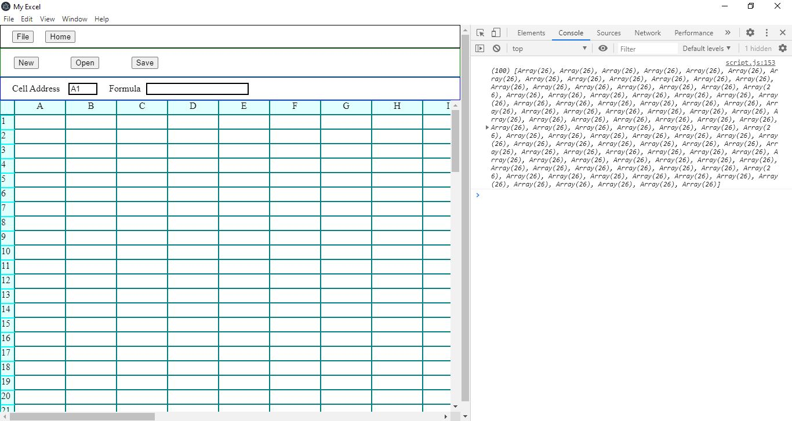
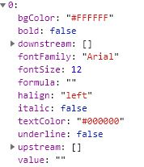
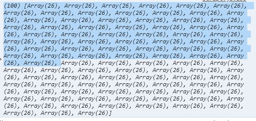
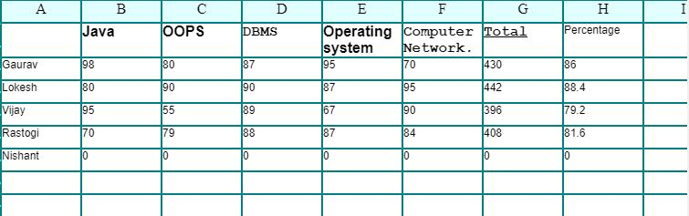
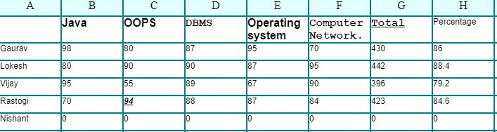
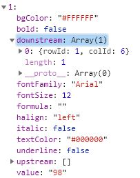
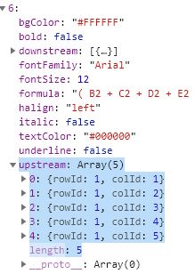

# Excel Cloning

    It simulate limited functionality of Microsoft Excel.Cross PlatForm DeskTop Application build using Electron.js. It combines the Chromium rendering engine and the Node.js runtime

## Features

1.  Formatting
2.  Simple Formulas Evaluation
    - Graphs Cycle Check(Formula Dependency)
    - Infix Evaluation
3.  New Open Save
4.  Cell Responsive
5.  Scroll Bar

### Algorithms Used

1. Depth First Search
2. Cycle check in Directed Graph

  <b>App UI</b>

  

  <b>Each cell State</b>

  

  <b>DataBase</b>

  

  <b>First Image</b>

  

  <b>Second Image</b>

  

  <b>Updated State of Cell</b>

  

  <b>Upstream And DownStream Object</b>

  
